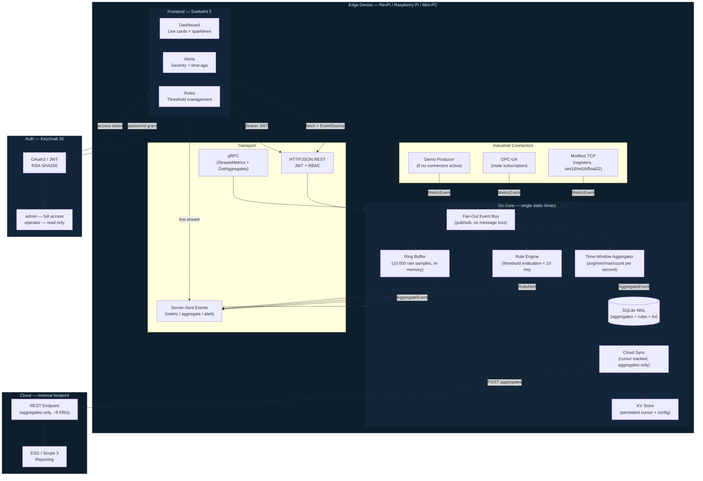

# Full-Stack IIoT Edge Template

[](https://go.dev)
[](https://kit.svelte.dev)
[](https://sqlite.org)
[](https://opensource.org/licenses/MIT)
[](https://github.com)

A production-ready, **Green IT** full-stack template for industrial IoT and automation edge devices. Clone it, configure your connectors, and run — as a single 18 MB static binary on Revolution Pi, Raspberry Pi, mini-PCs, and industrial computers, consuming under 30 MB RAM with zero cloud dependency. 

---

## What This Is

A complete full-stack template for building industrial edge applications: sensors talk Modbus TCP or OPC-UA, data is aggregated locally in 1-second windows, threshold rules fire alerts in under 10 ms, and only compressed summaries reach the cloud. The frontend streams live data over SSE with no polling. Auth is Keycloak with RSA-verified JWTs and RBAC. The entire Go backend is a single static binary with no external runtime.

---

## Stack

| Layer | Technology | Notes |
|---|---|---|
| Frontend | SvelteKit 5 + Svelte 5 | SSE-driven, no polling, light/dark mode |
| Desktop Shell | Tauri (optional) | Native window for HMI displays |
| Backend | Go 1.24, static binary | No JVM, no Node, no interpreter |
| Database | SQLite WAL | Offline-first, concurrent reads |
| Auth | Keycloak 26, OAuth2 / JWT / RBAC | RSA-SHA256 token verification |
| Streaming | Server-Sent Events + gRPC | Real-time push to browser and external systems |
| Connectors | Modbus TCP, OPC-UA stub | Extensible connector interface |
| Observability | Prometheus `/metrics` | Drop-in Grafana integration |
| Deployment | Docker Compose, systemd, OTA | Three deployment modes |
| Target Hardware | RevPi, Raspberry Pi, IPC, x86-64 | ARMv7, ARM64, AMD64 |

---

## Architecture



---

## Green IT Principles

Every architectural choice in this platform has a direct, measurable impact on energy consumption, hardware lifespan, and cloud infrastructure load. Sustainability is the result of the architecture — not a label applied afterward.

### Less Cloud

Business logic, aggregation, and rule evaluation run entirely on the edge device. What is computed locally never reaches a data center.

| Metric | Cloud-First | This Platform |
|---|---|---|
| Data sent to cloud | ~1 MB/s raw sensor stream | ~8 KB/s aggregated summaries |
| Cloud compute | Continuous, always-on server | Near zero — receive and store only |
| Network bandwidth | High, continuous | −99% |
| Rule evaluation latency | 100–500 ms cloud round-trip | < 10 ms local |
| Offline capability | Breaks without connectivity | Full function, no internet needed |

A Revolution Pi running this stack draws approximately **5 W**. An equivalent always-on cloud VM draws 200–400 W. The difference is structural.

### Less Power

The Go backend compiles to a **single static binary** with no external runtime dependencies. No JVM, no Node.js process, no Python interpreter, no database daemon. The binary idles at under 30 MB RAM and immediately releases the CPU when there is nothing to process.

SQLite in WAL mode eliminates the need for a separate database process — no PostgreSQL daemon, no connection pooling, no background vacuum consuming resources continuously.

> **Development vs. Production:** Running `docker compose up` on your PC starts Keycloak (a Java application) which alone uses 700 MB – 1.2 GB RAM. This is expected — Keycloak is your auth server for development, not a component deployed on the edge device. The `< 30 MB` figure is the bare-metal edge binary only.

### Longer Hardware Life

The binary targets ARMv7, ARM64, and AMD64 and runs on hardware from 2016 onward without modification. No framework deprecation forces hardware upgrades. No new Node.js version that drops support for an older kernel. No container runtime that requires more RAM than the device has.

Every year a device stays in production instead of being replaced avoids the embodied carbon of manufacturing a new unit. For industrial hardware, embodied carbon is typically **150–300 kg CO₂ equivalent per device**. Extending lifecycle from 5 to 10 years cuts that impact in half.

### Offline First

The application functions completely without internet connectivity. SQLite stores all data locally. The rule engine evaluates conditions and triggers alerts without a cloud round-trip. The SSE stream delivers live data to the local browser dashboard with no external dependency.

Cloud sync is selective and asynchronous — only aggregated values are transmitted when connectivity is available. A persistent cursor in the SQLite KV table tracks what has already been sent; sync resumes automatically after outages with no data loss.

### Measurable Impact

```
Energy saved per device per year:
  Cloud server equivalent:       ~350 W × 8,760 h = 3,066 kWh
  Edge device with this stack:     ~5 W × 8,760 h =    44 kWh
  Saving per device per year:                       ~3,022 kWh

CO₂ equivalent (EU grid ~0.4 kg/kWh):
  Saving per device per year:                     ~1,209 kg CO₂

Hardware embodied carbon avoided (10 yr vs 5 yr lifecycle):
  ~150–300 kg CO₂ per device, per replacement cycle avoided
```

These numbers can be used directly in ESG reporting, Scope 3 emissions disclosures, and Product Carbon Footprint (PCF) calculations.

---

## System Requirements

### Development (Docker Compose on PC)

| Component | RAM | Disk |
|---|---|---|
| Keycloak 26 (JVM, dev mode) | 700 MB – 1.2 GB | ~500 MB |
| Go backend | ~20 MB | ~20 MB |
| SvelteKit / Node.js | ~100 MB | ~180 MB |
| **Total** | **~800 MB – 1.5 GB** | **~1.5 – 2 GB** |

**Recommended:** 8 GB RAM PC, 5 GB free disk. Your 8 GB PC runs this comfortably with 6+ GB free.

### Edge Device — Bare Metal (Production)

| Component | RAM | Disk |
|---|---|---|
| Go binary (all-in-one) | ~20 MB | ~18 MB |
| SQLite data (aggregates) | ~1 MB/day | grows slowly |
| **Total** | **< 30 MB** | **< 50 MB** |

**Minimum device:** 128 MB RAM (Revolution Pi 3 with 1 GB is very comfortable).
CPU: ~2% idle, releases scheduler immediately when there is nothing to process.

---

## Quick Start

```bash
# Clone and start the full stack (Keycloak + Backend + Frontend)
git clone <repo-url>
cd full-stack-go-SvelteKit-SQLite-template
docker compose up --build
```

Wait ~60 seconds for Keycloak first start. Then open:

| Service | URL | Default Credentials |
|---|---|---|
| **Frontend Dashboard** | http://localhost:3000 | admin / admin |
| Backend API | http://localhost:8080 | JWT required |
| Keycloak Admin Console | http://localhost:8180 | admin / admin |

### Default Users

| Username | Password | Role | Permissions |
|---|---|---|---|
| `admin` | `admin` | Administrator | Full access — create and manage rules |
| `operator` | `operator` | Operator | Read-only — view dashboards and sensor data |

### Test the API

```bash
# Get a JWT access token
TOKEN=$(curl -s -X POST http://localhost:8180/realms/edge/protocol/openid-connect/token \
  -d "grant_type=password&client_id=edge-frontend&username=admin&password=admin" \
  | jq -r .access_token)

# Query system status
curl -H "Authorization: Bearer $TOKEN" http://localhost:8080/api/v1/status | jq

# Stream live events (open in a second terminal)
curl -N -H "Authorization: Bearer $TOKEN" http://localhost:8080/api/v1/stream
```

---

## Deploy to Edge Device

The Go backend compiles to a single static binary with no external dependencies. Copy it to any Linux device and run it directly.

### Step 1 — Build the Binary for Your Target

**Raspberry Pi 4 / Revolution Pi 4 (ARM64)**
```bash
CGO_ENABLED=0 GOOS=linux GOARCH=arm64 \
  go build -ldflags="-s -w" -o dist/edge-app ./edge-app/cmd/edge-app
# Binary size: ~18 MB
```

**Raspberry Pi 3 / Revolution Pi 3 (ARMv7)**
```bash
CGO_ENABLED=0 GOOS=linux GOARCH=arm GOARM=7 \
  go build -ldflags="-s -w" -o dist/edge-app ./edge-app/cmd/edge-app
```

**Mini-PC / Siemens IPC / Beckhoff CX (x86-64)**
```bash
CGO_ENABLED=0 GOOS=linux GOARCH=amd64 \
  go build -ldflags="-s -w" -o dist/edge-app ./edge-app/cmd/edge-app
```

Or use the provided scripts:
```bash
./edge-app/scripts/build-arm64.sh   # ARM64
./edge-app/scripts/build-armv7.sh   # ARMv7
```

---

### Raspberry Pi 4 — Full Setup

**What you need:** Raspberry Pi 4 (2 GB+ RAM recommended), Raspberry Pi OS Lite 64-bit, SSH access.

```bash
# On your build machine — cross-compile for ARM64
CGO_ENABLED=0 GOOS=linux GOARCH=arm64 \
  go build -ldflags="-s -w" -o dist/edge-app-arm64 ./edge-app/cmd/edge-app

# Copy binary and config to the Pi
scp dist/edge-app-arm64      pi@raspberrypi.local:/opt/edge-app/edge-app
scp edge-app/config/app.yaml pi@raspberrypi.local:/opt/edge-app/config/

# SSH into the Pi and install as a service
ssh pi@raspberrypi.local
sudo mkdir -p /opt/edge-app/config /opt/edge-app/data
sudo chmod +x /opt/edge-app/edge-app
sudo cp /opt/edge-app/config/app.yaml /opt/edge-app/config/
```

Edit `/opt/edge-app/config/app.yaml` on the Pi:
```yaml
server:
  http_port: 8080
  grpc_port: 9090
database:
  path: /opt/edge-app/data/edge.db
aggregator:
  window_ms: 1000
```

Install systemd service:
```bash
sudo cp edge-app/deploy/systemd/edge-app.service /etc/systemd/system/
sudo systemctl daemon-reload
sudo systemctl enable --now edge-app
sudo systemctl status edge-app
```

Check it works:
```bash
curl http://localhost:8080/health
# → ok
```

**Resource usage on Raspberry Pi 4:**
```
RAM:   ~22 MB
CPU:   ~1.5% idle with demo data
Disk:  ~18 MB binary + ~1 MB/day data
Power: Pi 4 total draw ~3–5 W (board + binary)
```

---

### Raspberry Pi 3 — Setup

Same steps as Pi 4, but build for ARMv7:

```bash
CGO_ENABLED=0 GOOS=linux GOARCH=arm GOARM=7 \
  go build -ldflags="-s -w" -o dist/edge-app-armv7 ./edge-app/cmd/edge-app

scp dist/edge-app-armv7 pi@raspberrypi.local:/opt/edge-app/edge-app
```

The binary runs identically on Pi 3 (ARMv7). With 1 GB RAM on a Pi 3 Model B+, the edge binary uses under 3% of available memory.

---

### Revolution Pi 4 — Setup

Revolution Pi 4 runs Raspberry Pi OS with additional industrial I/O. Deployment is identical to Raspberry Pi 4 (ARM64):

```bash
# Build ARM64 binary
./edge-app/scripts/build-arm64.sh

# Deploy via SCP
scp dist/edge-app pi@revpi.local:/opt/edge-app/edge-app
scp edge-app/config/app.yaml pi@revpi.local:/opt/edge-app/config/
```

**Modbus configuration** for Revolution Pi I/O modules — edit `app.yaml`:
```yaml
connectors:
  modbus:
    enabled: true
    host: 127.0.0.1   # RevPi I/O via local Modbus bridge
    port: 502
    unit_id: 1
    poll_ms: 100
    registers:
      - address: 0
        key: temperature
        source: revpi-io
        type: float32
        scale: 0.1
      - address: 2
        key: pressure
        source: revpi-io
        type: uint16
        scale: 0.01
```

---

### Revolution Pi 3 — Setup

Build ARMv7 and deploy identically:

```bash
./edge-app/scripts/build-armv7.sh
scp dist/edge-app pi@revpi3.local:/opt/edge-app/edge-app
```

---

### Mini-PC (x86-64) — Setup

Suitable for Siemens IPC127E, Beckhoff CX, Intel NUC, or any x86-64 Linux device:

```bash
# Build native binary
CGO_ENABLED=0 GOOS=linux GOARCH=amd64 \
  go build -ldflags="-s -w" -o dist/edge-app-amd64 ./edge-app/cmd/edge-app

# Deploy
scp dist/edge-app-amd64 user@mini-pc.local:/opt/edge-app/edge-app
scp edge-app/config/app.yaml user@mini-pc.local:/opt/edge-app/config/
```

Install and start:
```bash
ssh user@mini-pc.local
sudo systemctl enable --now edge-app
```

---

### OTA (Over-the-Air) Update

Update a running device without downtime:

```bash
./edge-app/scripts/ota-deploy.sh user@device.local
```

The script: builds the new binary, copies it, creates a backup of the old binary, and restarts the service. Rollback is one file copy.

---

### systemd Service

The service file at [edge-app/deploy/systemd/edge-app.service](edge-app/deploy/systemd/edge-app.service) sets:
- `Restart=on-failure` with 5 s delay
- `MemoryMax=64M` guard
- `NoNewPrivileges=yes` security hardening
- `WorkingDirectory=/opt/edge-app`

```bash
sudo systemctl status edge-app    # check status
sudo journalctl -u edge-app -f    # follow logs
sudo systemctl restart edge-app   # restart
```

---

## Deployment Targets

| Device | Architecture | Min RAM | Typical Power | Status |
|---|---|---|---|---|
| Raspberry Pi 4 (1/2/4/8 GB) | ARM64 | 128 MB | 3–5 W | supported |
| Raspberry Pi 3 Model B+ | ARMv7 | 128 MB | 2–4 W | supported |
| Revolution Pi 4 | ARM64 | 128 MB | 5 W | supported |
| Revolution Pi 3 | ARMv7 | 128 MB | 4 W | supported |
| Siemens IPC127E | x86-64 | 256 MB | 15 W | supported |
| Beckhoff CX5100 / CX5200 | x86-64 | 256 MB | 7–15 W | supported |
| Intel NUC / Any x86-64 Mini-PC | x86-64 | 256 MB | 6–25 W | supported |
| Generic ARM SBC (≥ARMv7) | ARMv7+ | 128 MB | 3 W+ | supported |

---

## Project Structure

```
.
├── docker-compose.yml              # Dev stack: Keycloak + Backend + Frontend
├── go.mod / go.sum                 # Go module
├── config/
│   └── keycloak/
│       └── edge-realm.json         # Keycloak realm: roles, clients, users
├── edge-app/
│   ├── cmd/edge-app/main.go        # Entry point — wires all components
│   ├── config/app.yaml             # Runtime config (ports, DB path, connectors)
│   ├── deploy/
│   │   ├── docker/Dockerfile       # Multi-stage Go build → minimal image
│   │   └── systemd/edge-app.service
│   ├── internal/
│   │   ├── aggregator/
│   │   │   ├── aggregator.go       # Time-window avg/min/max/count
│   │   │   ├── persist.go          # Write aggregates to SQLite
│   │   │   └── raw_capture.go      # Fill ring buffer from bus
│   │   ├── api/
│   │   │   ├── http.go             # REST + SSE + JWT auth + RBAC
│   │   │   ├── raw.go              # /api/v1/raw — ring buffer snapshot
│   │   │   ├── status.go           # /api/v1/status — goroutines/RAM/uptime
│   │   │   └── grpc/
│   │   │       ├── server.go       # gRPC: StreamMetrics + GetAggregates
│   │   │       └── pb/edge.proto   # Protobuf definitions
│   │   ├── config/config.go        # YAML loader
│   │   ├── connector/
│   │   │   ├── connector.go        # Connector registry
│   │   │   ├── modbus.go           # Modbus TCP (uint16/int16/float32)
│   │   │   └── opcua.go            # OPC-UA template stub
│   │   ├── core/
│   │   │   ├── bus.go              # Fan-out pub/sub event bus
│   │   │   ├── events.go           # MetricEvent, AggregateEvent, RuleAlert
│   │   │   └── shutdown.go         # OS signal → context cancel
│   │   ├── logging/logger.go       # Structured logger
│   │   ├── metrics/prometheus.go   # Prometheus counters
│   │   ├── rules/rules.go          # Threshold rule engine (DB-backed)
│   │   ├── storage/
│   │   │   ├── sqlite.go           # WAL + prepared stmts + KV + rules table
│   │   │   └── ringbuffer/buffer.go
│   │   └── sync/cloud.go           # Selective cloud sync, cursor in KV
│   ├── scripts/
│   │   ├── build-arm64.sh          # ARM64 cross-compile
│   │   ├── build-armv7.sh          # ARMv7 cross-compile
│   │   ├── ota-deploy.sh           # Zero-downtime OTA update
│   │   ├── test-all.sh
│   │   ├── test-docker.sh
│   │   └── test-health.sh
│   └── tests/integration.sh
├── frontend/
│   ├── Dockerfile                  # Multi-stage Node build → Node adapter
│   ├── package.json
│   ├── svelte.config.js / vite.config.js
│   └── src/
│       ├── app.html
│       ├── lib/stores/api.js       # Auth + SSE + REST client
│       └── routes/
│           ├── +layout.svelte      # Sidebar, login, status footer
│           ├── +page.svelte        # Dashboard — live cards + sparklines
│           ├── alerts/+page.svelte # Alerts — severity, time-ago
│           └── rules/+page.svelte  # Rules — create threshold rules
└── src-tauri/                      # Optional: native desktop shell (Tauri)
    ├── Cargo.toml
    ├── tauri.conf.json
    └── src/main.rs
```

---

## API Reference

All `/api/v1/*` endpoints require a valid JWT in `Authorization: Bearer <token>`.

| Endpoint | Method | Role | Description |
|---|---|---|---|
| `/health` | GET | public | Health check — returns `ok` |
| `/metrics` | GET | public | Prometheus metrics |
| `/api/v1/status` | GET | any | Goroutines, heap MB, uptime seconds |
| `/api/v1/raw` | GET | any | Ring buffer snapshot (latest 10 000 samples) |
| `/api/v1/aggregates` | GET | any | Time-series aggregates (see params below) |
| `/api/v1/stream` | GET SSE | any | Live push: `metric`, `aggregate`, `alert` events |
| `/api/v1/rules` | GET | any | List all configured rules |
| `/api/v1/rules` | POST | **admin** | Create or update a threshold rule |

**Query parameters for `/api/v1/aggregates`:**

| Parameter | Default | Description |
|---|---|---|
| `window_ms` | `1000` | Aggregation window in milliseconds |
| `limit` | `100` | Max rows returned (max 500) |

**SSE event types** (received on `/api/v1/stream`):

| Event | Payload | Rate |
|---|---|---|
| `metric` | `{time, source, key, value, ok}` | Throttled: latest-per-key every 500 ms |
| `aggregate` | `{time, window_ms, metric, avg, min, max, count}` | Each window close |
| `alert` | `{time, key, value, message}` | On rule trigger |

The SSE token is accepted via `?token=<jwt>` query param (EventSource cannot set headers).

### gRPC Service

```protobuf
syntax = "proto3";
package edge;

service EdgeService {
  rpc StreamMetrics (StreamRequest) returns (stream MetricEvent);
  rpc GetAggregates (AggregateRequest) returns (AggregateResponse);
}

message StreamRequest {
  string key_filter = 1;  // optional — empty = stream all metrics
}

message MetricEvent {
  int64  time   = 1;  // Unix milliseconds
  string source = 2;
  string key    = 3;
  double value  = 4;
  bool   ok     = 5;
}

message AggregateRequest { int64 window_ms = 1; }

message Aggregate {
  int64  time      = 1;
  int64  window_ms = 2;
  string metric    = 3;
  double avg       = 4;
  double min       = 5;
  double max       = 6;
  int64  count     = 7;
}

message AggregateResponse { repeated Aggregate items = 1; }
```

---

## Connector Configuration

Edit [edge-app/config/app.yaml](edge-app/config/app.yaml). When no connectors are enabled, the system starts a demo producer with synthetic temperature, pressure, vibration, and RPM data.

### Modbus TCP

```yaml
connectors:
  modbus:
    enabled: true
    host: 192.168.1.100
    port: 502
    unit_id: 1
    poll_ms: 100
    registers:
      - { address: 0, key: temperature, source: plc-1, type: float32, scale: 0.1 }
      - { address: 2, key: pressure,    source: plc-1, type: uint16,  scale: 0.01 }
      - { address: 3, key: vibration,   source: plc-1, type: int16,   scale: 0.001 }
      - { address: 4, key: rpm,         source: plc-1, type: uint16,  scale: 1.0 }
```

Register types: `uint16`, `int16`, `float32`. The `scale` factor is multiplied with the raw register value.

### OPC-UA

```yaml
connectors:
  opcua:
    enabled: true
    endpoint: opc.tcp://192.168.1.200:4840
    poll_ms: 1000
    nodes:
      - { node_id: "ns=2;s=Temperature", key: temperature, source: opc-server-1 }
      - { node_id: "ns=2;s=Pressure",    key: pressure,    source: opc-server-1 }
      - { node_id: "ns=2;s=RPM",         key: rpm,         source: opc-server-1 }
```

The OPC-UA connector is a ready template. To use with real servers, add `go get github.com/gopcua/opcua` and implement the read loop in [edge-app/internal/connector/opcua.go](edge-app/internal/connector/opcua.go).

### Cloud Sync (Optional)

Set the `CLOUD_SYNC_ENDPOINT` environment variable. Only aggregated records are synced. The last synced timestamp is persisted in the SQLite KV table, so syncing resumes exactly where it stopped after any outage.

```bash
CLOUD_SYNC_ENDPOINT=https://your-cloud.example.com/ingest ./edge-app
```

---

## Environment Variables

| Variable | Default | Description |
|---|---|---|
| `KEYCLOAK_URL` | `http://localhost:8180` | Keycloak base URL (for key fetch and issuer check) |
| `KEYCLOAK_REALM` | `edge` | Keycloak realm name |
| `CORS_ORIGIN` | `*` | Allowed CORS origin (set to exact frontend URL in production) |
| `CLOUD_SYNC_ENDPOINT` | _(empty)_ | Cloud ingest URL — sync disabled if not set |

---

## Tauri Desktop Shell (Optional)

For edge devices with displays, wrap the SvelteKit frontend as a native window — no browser installation required.

```bash
# Development
cd src-tauri && cargo tauri dev

# Production build (requires Rust)
cd src-tauri && cargo tauri build
```

---

## Green IT Summary

```
Single static binary — no JVM, no Node.js, no interpreter, no database daemon

Edge device resource footprint (bare-metal, production):
  < 30 MB RAM at idle
  < 20 MB binary on disk
  ~2% CPU idle or less
  5 W total device power draw (RevPi 4)

Development stack on PC (Docker Compose):
  ~800 MB – 1.5 GB RAM  (Keycloak JVM dominates)
  ~1.5 – 2 GB disk
  Recommended: 8 GB RAM  →  6+ GB free while running

Data efficiency:
  ~99% reduction in cloud-bound traffic (1 MB/s raw → 8 KB/s aggregated)
  Local rule evaluation < 10 ms — no cloud round-trip required
  Offline-first — full function without internet connectivity

Hardware:
  Runs on ARM hardware from 2016 onward (ARMv7, ARM64)
  10-year lifecycle target — avoids 150–300 kg CO₂ per replacement cycle
  Supports Raspberry Pi 3/4, Revolution Pi 3/4, IPC, Beckhoff, Siemens

Green IT compliance:
  Fan-out event bus — zero data loss between consumers
  Selective cloud sync — cursor-tracked, aggregates only
  RBAC — admin / operator role separation
  Prometheus metrics — Grafana-compatible observability
  Designed for ESG reporting and Scope 3 CO₂ disclosures
```

---

## License

[](https://opensource.org/licenses/MIT)
