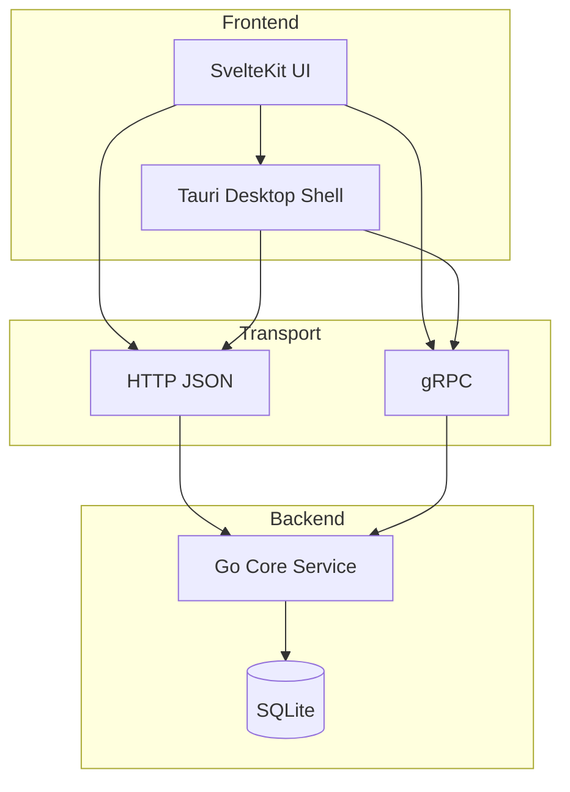

```mermaid
flowchart TB
    subgraph Frontend
        SK[SvelteKit UI]
        TA[Tauri Desktop Shell]
        SK --> TA
    end

    subgraph Transport
        HTTP[HTTP JSON]
        GRPC[gRPC]
    end

    subgraph Backend
        GO[Go Core Service]
        DB[(SQLite)]
    end

    SK --> HTTP
    TA --> HTTP
    SK --> GRPC
    TA --> GRPC

    HTTP --> GO
    GRPC --> GO

    GO --> DB
```
