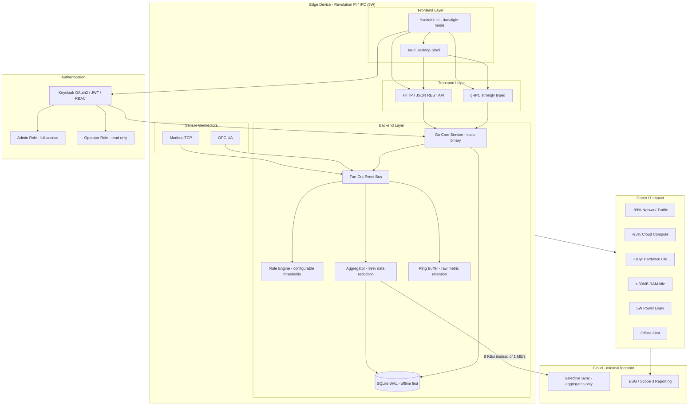

# IIoT Edge Full-Stack Template

A full-stack template for industrial micro-applications in the IIoT and automation domain, designed for reliable, resource-efficient operation on edge devices such as Revolution Pi, industrial PCs, and embedded Linux systems.

The backend is built with Go and SQLite and exposes HTTP/JSON APIs and gRPC for efficient, low-latency, strongly typed communication. The frontend is built with SvelteKit and optionally wrapped as a native desktop application with Tauri. Authentication is handled by Keycloak with OAuth2, JWT tokens, and role-based access control. Sensor data acquisition supports Modbus TCP and OPC-UA industrial protocols.

---

## Stack

| Layer | Technology |
|---|---|
| Frontend | SvelteKit (dark/light mode, green industrial theme) |
| Desktop Shell | Tauri |
| Backend | Go (single static binary, no runtime dependencies) |
| Database | SQLite (WAL mode, offline first) |
| Auth | Keycloak (OAuth2 / JWT / RBAC) |
| API | HTTP/JSON REST + gRPC (strongly typed) |
| Connectors | Modbus TCP + OPC-UA |
| Metrics | Prometheus |
| Target Hardware | Revolution Pi, IPC, ARM64, ARMv7, x86-64 |
| Deployment | Docker Compose, systemd, single binary |

---

## Architecture


---

## Architecture Details

### Fan-Out Event Bus

The central coordination mechanism is a publish-subscribe event bus that distributes sensor data to multiple concurrent consumers. Unlike a simple shared channel where consumers compete for messages, the fan-out bus creates independent channel subscriptions for each consumer. When a metric event is published, every subscriber receives its own copy of the event. This ensures that the raw capture component, the aggregator, the rule engine, and any future consumers all receive complete data streams without interference.

### Time-Window Aggregator

The aggregator subscribes to the metric event stream and computes statistical summaries over configurable time windows. For each metric key within a window, the aggregator calculates the average, minimum, maximum, and count of observed values. At the end of each window, these aggregates are published to a separate aggregate event stream and persisted to SQLite. Raw sensor data arriving at ten samples per second is reduced to one aggregate per second, achieving a 90 percent reduction at the first stage. Combined with selective cloud synchronization, total data reduction exceeds 99 percent.

### Rule Engine

The rule engine subscribes to aggregate events and evaluates configurable threshold conditions. Each rule specifies a metric key, a condition type (average greater than, maximum greater than, or minimum less than), a threshold value, and an alert message. Rules can be created and managed through the REST API by users with the administrator role. Operators have read-only access. Alert latency is under ten milliseconds regardless of network connectivity.

### Industrial Protocol Connectors

The system includes connector implementations for Modbus TCP and OPC-UA. The Modbus connector supports reading holding registers of type uint16, int16, and float32 with configurable register addresses, scaling factors, and poll intervals. The OPC-UA connector provides a template ready for integration with the gopcua library. When no connectors are enabled, the system automatically activates a demo data producer that generates realistic synthetic sensor data for temperature, pressure, vibration, and motor RPM.

### Data Storage

SQLite in Write-Ahead Logging mode serves as the persistent storage layer. WAL mode enables concurrent reads during writes without blocking. Raw sensor data is retained in an in-memory ring buffer of configurable size, providing immediate access to recent high-resolution data without database write overhead for every sample.

### Cloud Synchronization

Cloud sync is selective and asynchronous. Only aggregated values are transmitted to a configurable endpoint when connectivity is available. The sync module tracks the timestamp of the last successfully transmitted record and resumes from that point after interruptions. No duplicate transmissions, no data loss. This reduces upstream traffic from approximately 1 MB/s of raw data to approximately 8 KB/s of aggregated summaries.

### Authentication and Authorization

Keycloak provides enterprise-grade OAuth2 authentication with JWT tokens. The edge realm is auto-imported on first start with preconfigured clients and users. The backend validates JWT tokens on every protected API request, checking token expiration and issuer claims. Two roles are supported: administrators with full access including rule creation, and operators with read-only access to dashboards and sensor data.

### Frontend

SvelteKit application with a green industrial theme and dark/light mode toggle. Three pages: Dashboard with live sensor value cards and aggregate history table, Alerts showing threshold violations, and Rules for creating and managing alert rules. The frontend authenticates against Keycloak using the OAuth2 password grant and sends JWT tokens to the backend. For edge devices with displays, the frontend can be wrapped as a native desktop application using Tauri.

---

## Green IT Principles

This template is designed from the ground up around Green IT. Every architectural decision has a direct impact on energy consumption, hardware lifespan, and cloud infrastructure load. Sustainability is not a feature added on top — it is the result of the architecture itself.

### Less Cloud

Business logic, aggregation, and rule evaluation run entirely on the edge device. What is computed locally never reaches a data center. This directly reduces server capacity, cooling demand, and energy consumption in the cloud.

A Revolution Pi running this stack draws approximately 5 watts. An equivalent cloud server draws 200-400 watts. The difference is structural, not configurational.

| Metric | Cloud-first Architecture | This Template |
|---|---|---|
| Data sent to cloud | ~1 MB/s raw | ~8 KB/s aggregated |
| Cloud compute required | continuous | minimal |
| Network bandwidth | high | -99% |
| Latency for local rules | 100-500 ms roundtrip | < 10 ms local |

### Less Power

Go compiles to a single static binary with no external runtime dependencies. There is no JVM, no Node.js process, no Python interpreter running in the background. The application idles at under 30 MB RAM and releases CPU when there is nothing to process.

SQLite in WAL mode eliminates the need for a separate database process. There is no PostgreSQL daemon, no connection pooling overhead, no background vacuum process consuming resources continuously.

This means the hardware spends most of its time idle — and idle hardware consumes almost no energy.

### Longer Hardware Life

The binary targets ARMv7 and ARM64 and runs on hardware from 2016 onward without modification. There are no framework dependencies that force hardware upgrades. No new Node.js version that drops support for an older kernel. No container runtime that requires more RAM than the device has.

Every year a device stays in production instead of being replaced avoids the embodied carbon of manufacturing a new unit. For industrial hardware, embodied carbon typically accounts for 150-300 kg CO2 equivalent per device. Extending the lifespan from 5 to 10 years cuts that impact in half.

### Offline First

The application functions completely without internet connectivity. SQLite stores all data locally. The rule engine evaluates conditions and triggers actions without a cloud roundtrip. Alarms fire in under 10 milliseconds regardless of network state.

Cloud sync is selective and asynchronous. Only aggregated values are transmitted when connectivity is available. The sync tracks what has already been sent and resumes automatically after outages. No data is lost, no manual intervention is required.

This design eliminates the energy cost of maintaining a persistent cloud connection and reduces the carbon intensity of the entire system.

### Measurable Impact

Green IT is not a label — it is a number. This template is designed so that its environmental impact can be calculated and reported.
```
Energy saved per device per year:
  Cloud server equivalent:     ~350W x 8,760h = 3,066 kWh
  Edge device with this stack:   ~5W x 8,760h =    44 kWh
  Saving per device:                            ~3,022 kWh

CO2 equivalent (EU grid ~0.4 kg/kWh):
  Saving per device per year:               ~1,209 kg CO2

Hardware embodied carbon avoided (10yr vs 5yr lifecycle):
  ~150-300 kg CO2 per device avoided replacement
```

These numbers can be used directly in ESG reporting, Scope 3 disclosures, and Product Carbon Footprint (PCF) calculations.

---

## Quick Start
```bash
docker compose up --build
```

Wait about 60 seconds for Keycloak first start. Then:

| Service | URL | Credentials |
|---|---|---|
| Frontend | http://localhost:3000 | admin / admin |
| Backend API | http://localhost:8080 | JWT token required |
| Keycloak Admin | http://localhost:8180 | admin / admin |

### Test Authentication
```bash
# Get JWT token
curl -X POST http://localhost:8180/realms/edge/protocol/openid-connect/token \
  -d "grant_type=password&client_id=edge-frontend&username=admin&password=admin"

# Use token for API access
curl -H "Authorization: Bearer <token>" http://localhost:8080/api/v1/status
```

### Default Users

| Username | Password | Role | Permissions |
|---|---|---|---|
| admin | admin | Administrator | Full access, create/edit rules |
| operator | operator | Operator | Read-only, view dashboards and data |

---

## Project Structure
```
.
├── docker-compose.yml                  # Orchestrates Keycloak + Backend + Frontend
├── go.mod                              # Go module definition
├── go.sum                              # Go dependency checksums
├── .gitignore                          # Git ignore rules
├── config/
│   └── keycloak/
│       └── edge-realm.json             # Keycloak realm with roles and users
├── edge-app/
│   ├── cmd/
│   │   └── edge-app/
│   │       └── main.go                 # Application entry point
│   ├── config/
│   │   └── app.yaml                    # App config (ports, DB, connectors)
│   ├── deploy/
│   │   ├── docker/
│   │   │   └── Dockerfile              # Multi-stage Go build
│   │   └── systemd/
│   │       └── edge-app.service        # Systemd unit for bare-metal deploy
│   ├── internal/
│   │   ├── aggregator/
│   │   │   ├── aggregator.go           # Time-window aggregation
│   │   │   ├── persist.go              # Aggregate to SQLite persistence
│   │   │   └── raw_capture.go          # Raw metric ring buffer capture
│   │   ├── api/
│   │   │   ├── http.go                 # HTTP API with JWT auth and RBAC
│   │   │   ├── raw.go                  # Raw ring buffer endpoint
│   │   │   ├── status.go              # System status endpoint
│   │   │   └── grpc/
│   │   │       ├── server.go           # gRPC service implementation
│   │   │       └── pb/
│   │   │           └── edge.proto      # Protocol buffer definitions
│   │   ├── config/
│   │   │   └── config.go              # YAML config loader
│   │   ├── connector/
│   │   │   ├── connector.go           # Connector manager
│   │   │   ├── modbus.go             # Modbus TCP connector
│   │   │   └── opcua.go              # OPC-UA connector (stub)
│   │   ├── core/
│   │   │   ├── bus.go                 # Fan-out event bus
│   │   │   ├── events.go             # Event type definitions
│   │   │   └── shutdown.go           # Graceful shutdown handler
│   │   ├── logging/
│   │   │   └── logger.go             # Structured logger
│   │   ├── metrics/
│   │   │   └── prometheus.go         # Prometheus counters
│   │   ├── rules/
│   │   │   └── rules.go              # Configurable rule engine
│   │   ├── storage/
│   │   │   ├── sqlite.go             # SQLite WAL storage
│   │   │   └── ringbuffer/
│   │   │       └── buffer.go         # In-memory ring buffer
│   │   └── sync/
│   │       └── cloud.go              # Selective cloud sync with tracking
│   ├── scripts/
│   │   ├── build-arm64.sh            # ARM64 cross-compilation
│   │   ├── build-armv7.sh            # ARMv7 cross-compilation
│   │   ├── ota-deploy.sh             # Over-the-air deployment
│   │   ├── test-all.sh               # Run all tests
│   │   ├── test-docker.sh            # Docker integration test
│   │   └── test-health.sh            # Health check test
│   └── tests/
│       └── integration.sh            # Integration test suite
├── frontend/
│   ├── Dockerfile                     # Multi-stage Node.js build
│   ├── package.json                   # Node.js dependencies
│   ├── svelte.config.js              # SvelteKit adapter config
│   ├── vite.config.js                # Vite build config
│   └── src/
│       ├── app.html                   # HTML shell
│       ├── lib/
│       │   └── stores/
│       │       └── api.js             # API client with Keycloak auth
│       └── routes/
│           ├── +layout.svelte         # Layout with sidebar and login
│           ├── +page.svelte           # Dashboard with live sensor cards
│           ├── alerts/
│           │   └── +page.svelte       # Alert history view
│           └── rules/
│               └── +page.svelte       # Rule management view
└── src-tauri/
    ├── Cargo.toml                     # Rust dependencies
    ├── build.rs                       # Tauri build script
    ├── tauri.conf.json               # Tauri window and build config
    └── src/
        └── main.rs                    # Tauri entry point
```

---

## API Endpoints

All `/api/v1/*` endpoints require a valid JWT token in the `Authorization: Bearer <token>` header.

| Endpoint | Method | Auth | Role | Description |
|---|---|---|---|---|
| `/health` | GET | none | any | Public health check, returns "ok" |
| `/api/v1/status` | GET | JWT | any | System health: goroutines, memory, uptime |
| `/api/v1/aggregates` | GET | JWT | any | Aggregated time series data |
| `/api/v1/raw` | GET | JWT | any | Raw ring buffer snapshot |
| `/api/v1/rules` | GET | JWT | any | List all active rules |
| `/api/v1/rules` | POST | JWT | admin | Create or update a rule |
| `/metrics` | GET | none | any | Prometheus metrics |

### Query Parameters

| Endpoint | Parameter | Default | Description |
|---|---|---|---|
| `/api/v1/aggregates` | `window_ms` | 1000 | Aggregation window in milliseconds |
| `/api/v1/aggregates` | `limit` | 100 | Maximum number of results (max 500) |

### gRPC Service
```protobuf
service EdgeService {
  rpc StreamMetrics (StreamRequest) returns (stream MetricEvent);
  rpc GetAggregates (AggregateRequest) returns (AggregateResponse);
}

message MetricEvent {
  int64 time = 1;
  string source = 2;
  string key = 3;
  double value = 4;
  bool ok = 5;
}

message Aggregate {
  int64 time = 1;
  int64 window_ms = 2;
  string metric = 3;
  double avg = 4;
  double min = 5;
  double max = 6;
  int64 count = 7;
}
```

---

## Connector Configuration

Connectors are configured in `edge-app/config/app.yaml`. When no connectors are enabled, the system runs a demo data producer with synthetic sensor data.

### Modbus TCP
```yaml
connectors:
  modbus:
    enabled: true
    host: 192.168.1.100
    port: 502
    unit_id: 1
    poll_ms: 500
    registers:
      - address: 0
        key: temperature
        source: plc-1
        type: float32
        scale: 0.1
      - address: 2
        key: pressure
        source: plc-1
        type: uint16
        scale: 0.01
      - address: 3
        key: vibration
        source: plc-1
        type: int16
        scale: 0.001
```

Supported register types: `uint16`, `int16`, `float32`. The scale factor is multiplied with the raw register value.

### OPC-UA
```yaml
connectors:
  opcua:
    enabled: true
    endpoint: opc.tcp://192.168.1.200:4840
    poll_ms: 1000
    nodes:
      - node_id: "ns=2;s=Temperature"
        key: temperature
        source: opcua-server-1
      - node_id: "ns=2;s=Pressure"
        key: pressure
        source: opcua-server-1
      - node_id: "ns=2;s=RPM"
        key: rpm
        source: opcua-server-1
```

The OPC-UA connector is provided as a template stub. To use with real OPC-UA servers, add the gopcua library: `go get github.com/gopcua/opcua`.

---

## Build for Edge Device

### ARM64 (Revolution Pi 4, modern IPCs)
```bash
./edge-app/scripts/build-arm64.sh
```

### ARMv7 (Revolution Pi 3, older embedded hardware)
```bash
./edge-app/scripts/build-armv7.sh
```

### AMD64 (Siemens IPC, Beckhoff CX, standard PCs)
```bash
CGO_ENABLED=0 GOOS=linux GOARCH=amd64 go build -ldflags="-s -w" -o dist/edge-app ./edge-app/cmd/edge-app
```

---

## Deploy to Device

### Via SCP and systemd
```bash
scp dist/edge-app user@device:/opt/edge-app/
scp edge-app/config/app.yaml user@device:/opt/edge-app/config/
scp edge-app/deploy/systemd/edge-app.service user@device:/etc/systemd/system/
ssh user@device "systemctl enable --now edge-app"
```

### Via OTA (Over-the-Air Update)
```bash
./edge-app/scripts/ota-deploy.sh user@device
```

This script copies the new binary, backs up the old one, and restarts the service with zero downtime.

### Via Docker Compose (Development)
```bash
docker compose up --build
```

---

## Tauri Desktop Shell

For edge devices with displays, the SvelteKit frontend can be wrapped as a native desktop application using Tauri. This creates a lightweight native window without requiring a browser installation.

### Development
```bash
cd src-tauri && cargo tauri dev
```

### Production Build
```bash
cd src-tauri && cargo tauri build
```

### Requirements

Tauri requires Rust installed on the build machine. The resulting binary is a single executable that includes the web frontend and a minimal WebView runtime.

---

## Deployment Targets

| Device | Architecture | RAM | Power | Status |
|---|---|---|---|---|
| Revolution Pi 4 | ARM64 | 2 GB | 5W | supported |
| Revolution Pi 3 | ARMv7 | 1 GB | 4W | supported |
| Siemens IPC127E | x86-64 | 4 GB | 15W | supported |
| Beckhoff CX series | x86-64 | 2 GB | 10W | supported |
| Generic ARM SBC | ARMv7+ | 512 MB+ | 3W+ | supported |

---

## Green IT Summary
```
Runs on existing hardware — no replacement needed
Single static binary — no runtime dependencies
< 30 MB RAM at idle
95-99% less data sent to cloud
Local rule evaluation < 10 ms latency
Offline-first — works without internet connectivity
Supports hardware from 2016 onward
Fan-out event bus — no data loss between consumers
Selective cloud sync — only aggregates, tracked offsets
Role-based access — admin and operator separation
Modbus TCP + OPC-UA — direct industrial protocol support
Designed for ESG reporting and Scope 3 disclosures
```

---

## License

MIT
