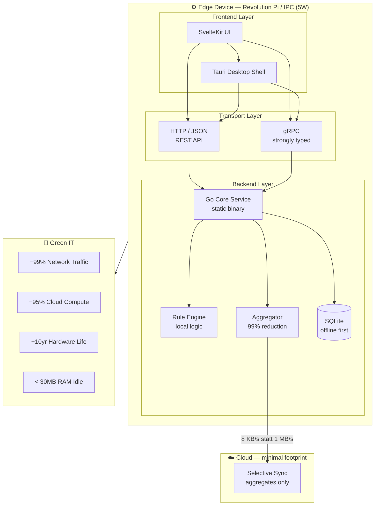

```mermaid
flowchart TB
    subgraph EDGE["⚙️ Edge Device — Revolution Pi / IPC (5W)"]
        subgraph Frontend["Frontend Layer"]
            SK[SvelteKit UI]
            TA[Tauri Desktop Shell]
            SK --> TA
        end

        subgraph Transport["Transport Layer"]
            HTTP[HTTP / JSON\nREST API]
            GRPC[gRPC\nstrongly typed]
        end

        subgraph Backend["Backend Layer"]
            GO[Go Core Service\nstatic binary]
            RE[Rule Engine\nlocal logic]
            AGG[Aggregator\n99% reduction]
            DB[(SQLite\noffline first)]
        end

        SK --> HTTP
        TA --> HTTP
        SK --> GRPC
        TA --> GRPC
        HTTP --> GO
        GRPC --> GO
        GO --> RE
        GO --> AGG
        GO --> DB
    end

    subgraph CLOUD["☁️ Cloud — minimal footprint"]
        SYNC[Selective Sync\naggregates only]
    end

    subgraph GREEN["🌱 Green IT"]
        G1[−99% Network Traffic]
        G2[−95% Cloud Compute]
        G3[+10yr Hardware Life]
        G4[< 30MB RAM Idle]
    end

    AGG -->|8 KB/s statt 1 MB/s| SYNC
    EDGE --> GREEN
```
