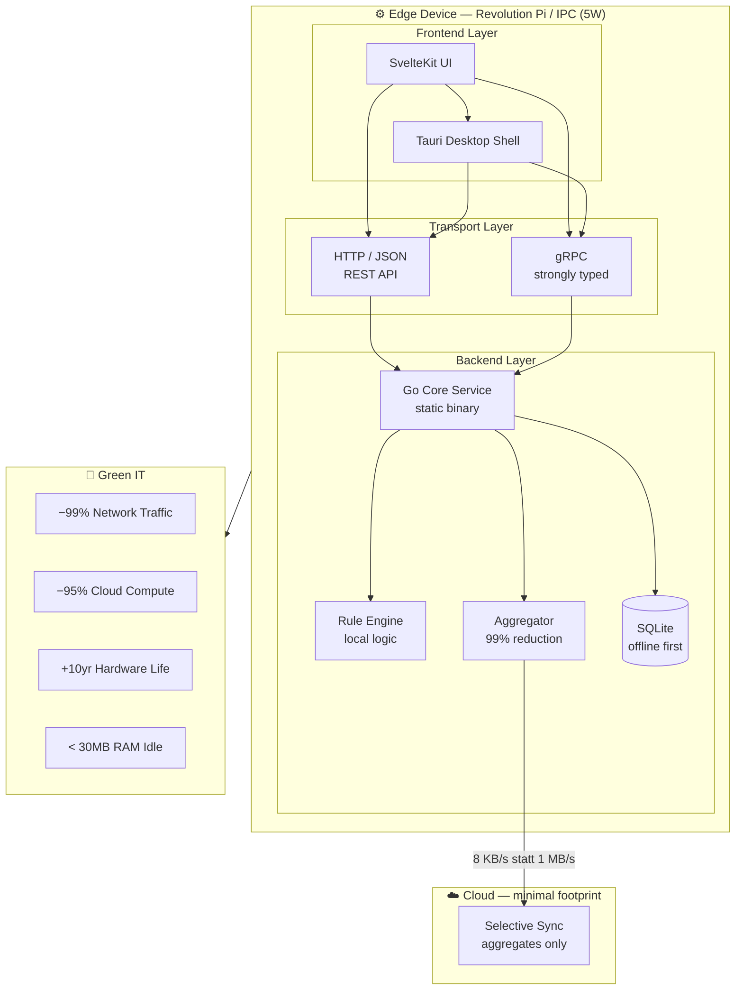
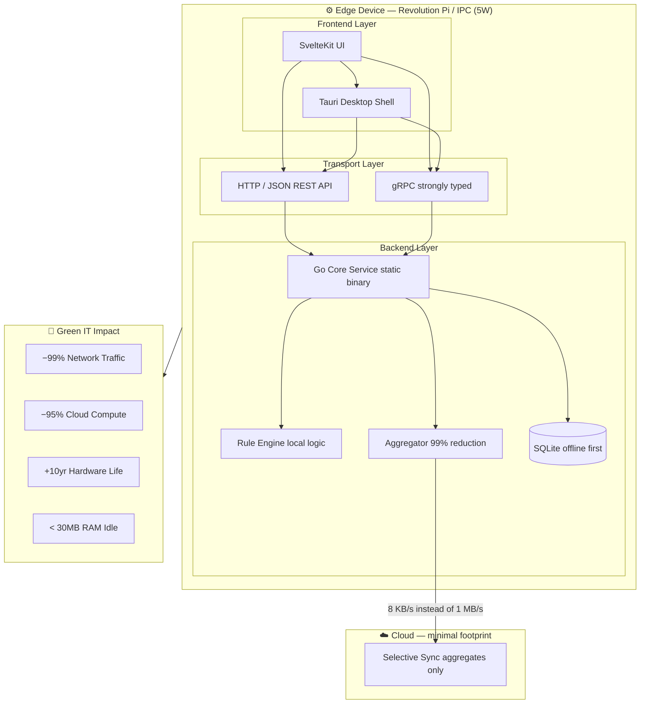

# IIoT Edge Full-Stack Template

A full-stack template for industrial micro-applications in the IIoT and automation domain, designed for reliable, resource-efficient operation on edge devices such as Revolution Pi, industrial PCs, and embedded Linux systems.

The backend is built with Go and SQLite and exposes HTTP/JSON APIs and gRPC for efficient, low-latency, strongly typed communication. The frontend is built with SvelteKit and optionally wrapped as a native desktop application with Tauri.

---

## Stack

| Layer | Technology |
|---|---|
| Frontend | SvelteKit |
| Desktop Shell | Tauri |
| Backend | Go |
| Database | SQLite (WAL mode) |
| API | HTTP/JSON + gRPC |
| Target Hardware | Revolution Pi, IPC, ARM64, ARMv7 |
| Deployment | systemd, single static binary |

---

## Architecture



---

## Green IT Principles

This template is designed from the ground up around Green IT. Every architectural decision has a direct impact on energy consumption, hardware lifespan, and cloud infrastructure load. Sustainability is not a feature added on top — it is the result of the architecture itself.

---

### Less Cloud

Business logic, aggregation, and rule evaluation run entirely on the edge device. What is computed locally never reaches a data center. This directly reduces server capacity, cooling demand, and energy consumption in the cloud.

A Revolution Pi running this stack draws approximately 5 watts. An equivalent cloud server draws 200–400 watts. The difference is structural, not configurational.

| Metric | Cloud-first Architecture | This Template |
|---|---|---|
| Data sent to cloud | ~1 MB/s raw | ~8 KB/s aggregated |
| Cloud compute required | continuous | minimal |
| Network bandwidth | high | −99% |
| Latency for local rules | 100–500 ms roundtrip | < 10 ms local |

---

### Less Power

Go compiles to a single static binary with no external runtime dependencies. There is no JVM, no Node.js process, no Python interpreter running in the background. The application idles at under 30 MB RAM and releases CPU when there is nothing to process.

SQLite in WAL mode eliminates the need for a separate database process. There is no PostgreSQL daemon, no connection pooling overhead, no background vacuum process consuming resources continuously.

This means the hardware spends most of its time idle — and idle hardware consumes almost no energy.

---

### Longer Hardware Life

The binary targets ARMv7 and ARM64 and runs on hardware from 2016 onward without modification. There are no framework dependencies that force hardware upgrades. No new Node.js version that drops support for an older kernel. No container runtime that requires more RAM than the device has.

Every year a device stays in production instead of being replaced avoids the embodied carbon of manufacturing a new unit. For industrial hardware, embodied carbon typically accounts for 150–300 kg CO₂ equivalent per device. Extending the lifespan from 5 to 10 years cuts that impact in half.

---

### Offline First

The application functions completely without internet connectivity. SQLite stores all data locally. The rule engine evaluates conditions and triggers actions without a cloud roundtrip. Alarms fire in under 10 milliseconds regardless of network state.

Cloud sync is selective and asynchronous. Only aggregated values are transmitted when connectivity is available. A local ring buffer retains raw data during outages and resumes sync automatically. No data is lost, no manual intervention is required.

This design eliminates the energy cost of maintaining a persistent cloud connection and reduces the carbon intensity of the entire system.

---

### Measurable Impact

Green IT is not a label — it is a number. This template is designed so that its environmental impact can be calculated and reported.

```
Energy saved per device per year:
  Cloud server equivalent:     ~350W × 8,760h = 3,066 kWh
  Edge device with this stack:   ~5W × 8,760h =    44 kWh
  Saving per device:                            ~3,022 kWh

CO₂ equivalent (EU grid ~0.4 kg/kWh):
  Saving per device per year:               ~1,209 kg CO₂

Hardware embodied carbon avoided (10yr vs 5yr lifecycle):
  ~150–300 kg CO₂ per device avoided replacement
```

These numbers are real and can be used directly in ESG reporting, Scope 3 disclosures, and Product Carbon Footprint (PCF) calculations.

---

## Project Structure

```
edge-app/
├── cmd/                  # Application entrypoint
├── internal/
│   ├── api/              # HTTP and gRPC handlers
│   ├── core/             # Business logic
│   ├── rules/            # Local rule engine
│   ├── aggregator/       # Time-window aggregation
│   └── storage/          # SQLite, ring buffer
├── frontend/             # SvelteKit application
├── config/               # YAML configuration schemas
├── deploy/
│   ├── systemd/          # Service unit files
│   └── ansible/          # Fleet provisioning
└── scripts/
    ├── build-arm64.sh
    ├── build-armv7.sh
    └── ota-deploy.sh
```

---

## Getting Started

### Prerequisites

- Go 1.22+
- Node.js 20+ (for frontend build)
- Rust (for Tauri desktop shell, optional)

### Build for Edge Device

```bash
# ARM64 (Revolution Pi 4, most modern IPCs)
GOOS=linux GOARCH=arm64 go build -o dist/edge-app ./cmd

# ARMv7 (Revolution Pi 3, older embedded hardware)
GOOS=linux GOARCH=arm GOARM=7 go build -o dist/edge-app-armv7 ./cmd

# Build frontend
cd frontend && npm install && npm run build
```

### Deploy

```bash
# Copy binary and static frontend to device
scp dist/edge-app user@device:/opt/edge-app/
scp -r frontend/build user@device:/opt/edge-app/static/

# Install and start systemd service
scp deploy/systemd/edge-app.service user@device:/etc/systemd/system/
ssh user@device "systemctl enable --now edge-app"
```

### Configuration

```yaml
# config/app.yaml
server:
  http_port: 8080
  grpc_port: 9090

database:
  path: /var/edge-app/data.db
  wal_mode: true

aggregator:
  windows: [1s, 1m, 15m]
  cloud_sync_interval: 60s

rules:
  path: /etc/edge-app/rules/
```

---

## API

### HTTP/JSON

```
GET  /api/v1/metrics          # current sensor values
GET  /api/v1/metrics/history  # aggregated time series
POST /api/v1/rules            # create or update rule
GET  /api/v1/status           # system health and resource usage
```

### gRPC

```protobuf
service EdgeService {
  rpc StreamMetrics (StreamRequest) returns (stream MetricEvent);
  rpc GetAggregates (AggregateRequest) returns (AggregateResponse);
  rpc TriggerAction (ActionRequest) returns (ActionResponse);
}
```

---

## Deployment Targets

| Device | Architecture | RAM | Power | Status |
|---|---|---|---|---|
| Revolution Pi 4 | ARM64 | 2 GB | 5W | ✓ supported |
| Revolution Pi 3 | ARMv7 | 1 GB | 4W | ✓ supported |
| Siemens IPC127E | x86-64 | 4 GB | 15W | ✓ supported |
| Beckhoff CX series | x86-64 | 2 GB | 10W | ✓ supported |
| Generic ARM SBC | ARMv7+ | 512 MB+ | 3W+ | ✓ supported |

---

## Green IT Summary

```
✓ Runs on existing hardware — no replacement needed
✓ Single static binary — no runtime dependencies
✓ < 30 MB RAM at idle
✓ 95–99% less data sent to cloud
✓ Local rule evaluation < 10 ms latency
✓ Offline-first — works without internet connectivity
✓ Supports hardware from 2016 onward
✓ Designed for Green IT and Scope 3 reporting
```

---

## License

MIT License — see LICENSE for details.
