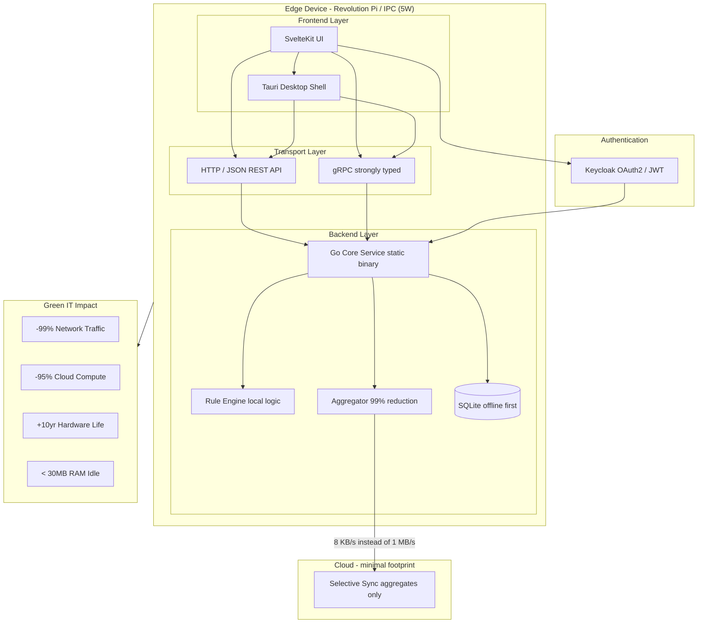

# IIoT Edge Full-Stack Template

A full-stack template for industrial micro-applications in the IIoT and automation domain, designed for reliable, resource-efficient operation on edge devices such as Revolution Pi, industrial PCs, and embedded Linux systems.

The backend is built with Go and SQLite and exposes HTTP/JSON APIs and gRPC for efficient, low-latency, strongly typed communication. The frontend is built with SvelteKit and optionally wrapped as a native desktop application with Tauri. Authentication is handled by Keycloak with OAuth2 and JWT tokens.

---

## Stack

| Layer | Technology |
|---|---|
| Frontend | SvelteKit (dark/light mode) |
| Desktop Shell | Tauri |
| Backend | Go (static binary) |
| Database | SQLite (WAL mode, offline first) |
| Auth | Keycloak (OAuth2 / JWT) |
| API | HTTP/JSON + gRPC |
| Metrics | Prometheus |
| Target Hardware | Revolution Pi, IPC, ARM64, ARMv7 |
| Deployment | Docker Compose, systemd |

---

## Architecture

