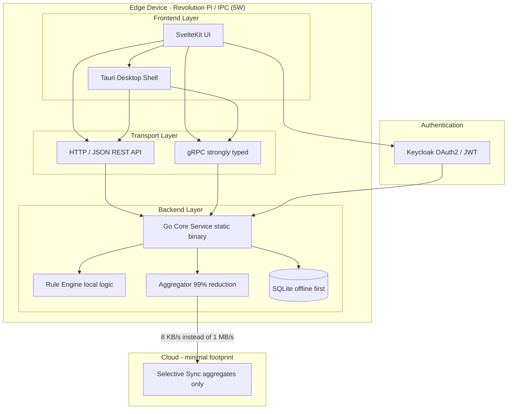

# IIoT Edge Full-Stack Template

A full-stack template for industrial micro-applications in the IIoT and automation domain, designed for reliable, resource-efficient operation on edge devices such as Revolution Pi, industrial PCs, and embedded Linux systems.

## Stack

| Layer | Technology |
|---|---|
| Frontend | SvelteKit |
| Desktop Shell | Tauri |
| Backend | Go (static binary) |
| Database | SQLite (WAL mode) |
| Auth | Keycloak (OAuth2 / JWT) |
| API | HTTP/JSON + gRPC |
| Target Hardware | Revolution Pi, IPC, ARM64, ARMv7 |
| Deployment | Docker Compose, systemd |

## Architecture


## Quick Start
```bash
docker compose up --build
```

Wait about 60 seconds for Keycloak first start. Then:

| Service | URL | Credentials |
|---|---|---|
| Frontend | http://localhost:3000 | admin / admin |
| Backend API | http://localhost:8080 | JWT token required |
| Keycloak Admin | http://localhost:8180 | admin / admin |

## Project Structure
```
.
├── docker-compose.yml
├── go.mod
├── config/
│   └── keycloak/
│       └── edge-realm.json
├── edge-app/
│   ├── cmd/edge-app/main.go
│   ├── config/app.yaml
│   ├── deploy/
│   │   ├── docker/Dockerfile
│   │   └── systemd/edge-app.service
│   ├── internal/
│   │   ├── aggregator/
│   │   │   ├── aggregator.go
│   │   │   ├── persist.go
│   │   │   └── raw_capture.go
│   │   ├── api/
│   │   │   ├── http.go
│   │   │   ├── raw.go
│   │   │   ├── status.go
│   │   │   └── grpc/
│   │   │       ├── server.go
│   │   │       └── pb/edge.proto
│   │   ├── config/config.go
│   │   ├── core/
│   │   │   ├── bus.go
│   │   │   ├── events.go
│   │   │   └── shutdown.go
│   │   ├── logging/logger.go
│   │   ├── metrics/prometheus.go
│   │   ├── rules/rules.go
│   │   ├── storage/
│   │   │   ├── sqlite.go
│   │   │   └── ringbuffer/buffer.go
│   │   └── sync/cloud.go
│   ├── scripts/
│   └── tests/
├── frontend/
│   ├── Dockerfile
│   ├── package.json
│   ├── svelte.config.js
│   ├── vite.config.js
│   └── src/
│       ├── app.html
│       ├── lib/stores/api.js
│       └── routes/
│           ├── +layout.svelte
│           ├── +page.svelte
│           ├── alerts/+page.svelte
│           └── rules/+page.svelte
└── src-tauri/
    ├── Cargo.toml
    ├── build.rs
    ├── tauri.conf.json
    └── src/main.rs
```

## API Endpoints

All `/api/v1/*` endpoints require a valid JWT token in the `Authorization: Bearer <token>` header.
```
GET  /health                          # Public health check
GET  /api/v1/status                   # System health and resource usage
GET  /api/v1/aggregates?window_ms=    # Aggregated time series
GET  /api/v1/raw                      # Raw ring buffer snapshot
GET  /api/v1/rules                    # List active rules
POST /api/v1/rules                    # Create or update a rule
GET  /metrics                         # Prometheus metrics
```

## Authentication

Keycloak provides OAuth2 authentication with JWT tokens.

Login via API:
```bash
curl -X POST http://localhost:8180/realms/edge/protocol/openid-connect/token \
  -d "grant_type=password&client_id=edge-frontend&username=admin&password=admin"
```

Use the returned `access_token` as Bearer token:
```bash
curl -H "Authorization: Bearer <token>" http://localhost:8080/api/v1/status
```

Default users:

| Username | Password | Role |
|---|---|---|
| admin | admin | Administrator |
| operator | operator | Operator |

## Frontend

SvelteKit application with dark/light mode toggle and green industrial theme.

Pages: Dashboard (live sensor cards), Alerts (threshold violations), Rules (create/manage).

### Tauri Desktop Shell

To run as native desktop app (requires Rust):
```bash
cd src-tauri && cargo tauri dev
```

## Build for Edge Device
```bash
# ARM64 (Revolution Pi 4, modern IPCs)
./edge-app/scripts/build-arm64.sh

# ARMv7 (Revolution Pi 3, older embedded)
./edge-app/scripts/build-armv7.sh
```

## Deploy to Device
```bash
scp dist/edge-app user@device:/opt/edge-app/
scp edge-app/deploy/systemd/edge-app.service user@device:/etc/systemd/system/
ssh user@device "systemctl enable --now edge-app"
```

## Deployment Targets

| Device | Architecture | RAM | Power | Status |
|---|---|---|---|---|
| Revolution Pi 4 | ARM64 | 2 GB | 5W | supported |
| Revolution Pi 3 | ARMv7 | 1 GB | 4W | supported |
| Siemens IPC127E | x86-64 | 4 GB | 15W | supported |
| Beckhoff CX series | x86-64 | 2 GB | 10W | supported |
| Generic ARM SBC | ARMv7+ | 512 MB+ | 3W+ | supported |

## Green IT

| Metric | Cloud-first | This Template |
|---|---|---|
| Data sent to cloud | ~1 MB/s raw | ~8 KB/s aggregated |
| Cloud compute required | continuous | minimal |
| Network bandwidth | high | -99% |
| Local rule latency | 100-500 ms roundtrip | < 10 ms local |
| RAM at idle | 200+ MB | < 30 MB |
```
Energy saved per device per year:
  Cloud server equivalent:     ~350W x 8,760h = 3,066 kWh
  Edge device with this stack:   ~5W x 8,760h =    44 kWh
  Saving per device:                            ~3,022 kWh
  CO2 equivalent (EU grid ~0.4 kg/kWh):        ~1,209 kg CO2
```

## License

MIT
